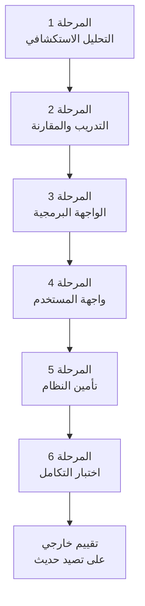
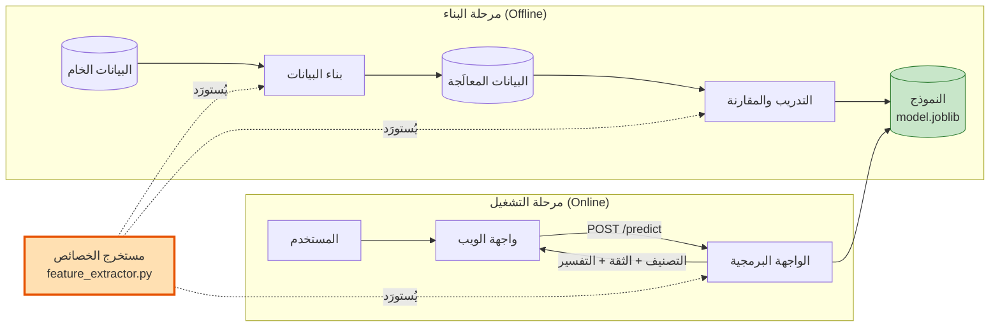
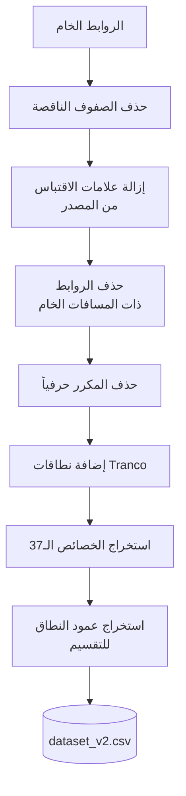
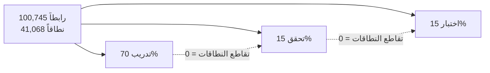
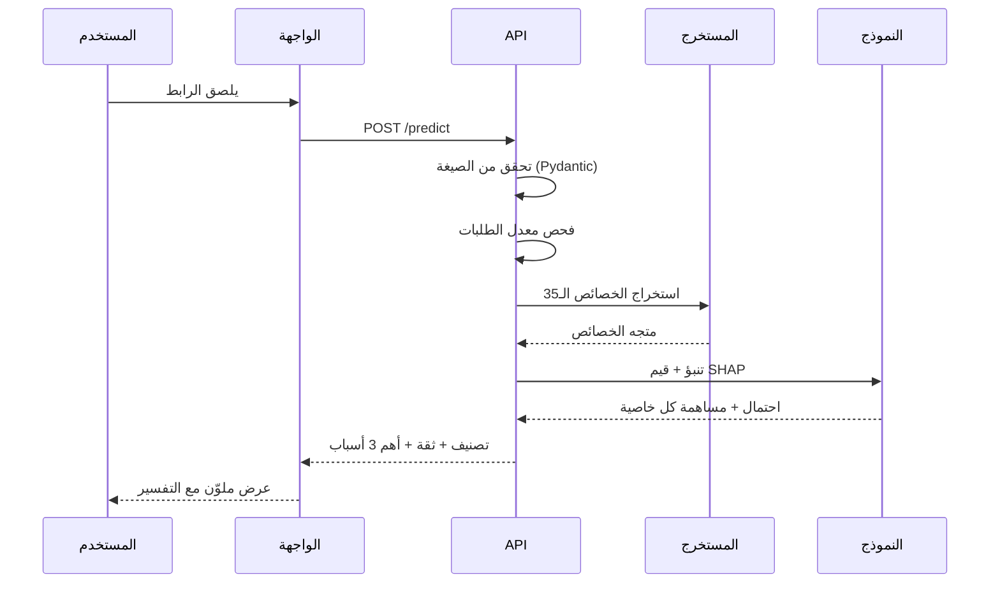
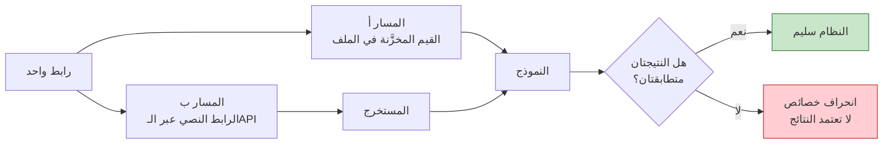

# الفصل الثالث: المنهجية وتصميم النظام

> هذا الفصل يصف **كيف بُني النظام ولماذا اتُّخذ كل قرار**. أما نتائج
> تطبيقه فمعروضة في الفصل الرابع (`results_and_discussion.md`).

---

## 3.1 مقدمة

يعرض هذا الفصل المنهجية المتبعة في بناء نظام كشف روابط التصيد الاحتيالي،
ويوثّق القرارات التصميمية مع مبرراتها. وقد اتُّبع في عرض كل قرار نمط
واحد: **البديل المتاح، والمشكلة فيه، والقرار المتخذ**، لأن قيمة القرار
الهندسي لا تظهر إلا بمقارنته بما تُرك.

---

## 3.2 منهجية البحث

### 3.2.1 نوع المنهج

اتُّبع **المنهج التجريبي التطبيقي**: بناء نظام عامل، ثم قياس أدائه
بمقاييس كمية، ثم تحليل حالات فشله. ولم يُكتفَ بالقياس على مجموعة اختبار
من مصدر البيانات نفسه، بل أُضيف **تقييم خارجي** على بيانات حديثة من
مصادر مستقلة، لأن الأول يثبت أن النموذج تعلّم، والثاني وحده يثبت أنه
ينفع.

### 3.2.2 مراحل العمل

نُفِّذ المشروع على ست مراحل متتابعة، لا يُنتقل من مرحلة إلى التي بعدها
قبل التحقق من عملها:



هذا التتابع مقصود: كل مرحلة تكشف مشكلات لا تظهر إلا بعد اكتمال ما قبلها.
وقد كشفت المرحلة السادسة فعلاً عطلاً بنيوياً في البيانات لم تكشفه المراحل
الخمس السابقة، كما هو موثَّق في القسم 3.8.3.

---

## 3.3 المعمارية العامة للنظام

### 3.3.1 المخطط المعماري



**الخط البرتقالي هو جوهر التصميم**: مستخرج الخصائص وحدة واحدة تُستورَد
في المسارات الثلاثة جميعاً. مبرر ذلك في القسم 3.5.1.

### 3.3.2 مبدأ الفصل بين مرحلتين

| المرحلة | التوقيت | التكلفة الزمنية | الناتج |
|-|-|-|-|
| البناء (Offline) | مرة واحدة | دقائق | نموذج محفوظ |
| التشغيل (Online) | مع كل طلب | أقل من ميلي ثانية | قرار مفسَّر |

هذا الفصل يجعل زمن الاستجابة مستقلاً عن حجم بيانات التدريب: النموذج
يُحمَّل مرة واحدة عند إقلاع الخادم لا مع كل طلب.

### 3.3.3 قيد التصميم الحاكم: لا اتصال بالشبكة

**القرار**: لا يفتح النظام الرابط المفحوص ولا يطلب محتواه ولا يتبع إعادة
التوجيه ولا يستعلم عن WHOIS. كل شيء يُحسب من نص الرابط.

**المبررات الثلاثة**:

1. **أمني**: لو فتح الخادم الرابط لصار هو نفسه ضحية للصفحة الخبيثة،
   ولأمكن استغلال النظام أداةً لمهاجمة مواقع أخرى نيابةً عن المهاجم.
2. **الأداء**: الاستعلام الشبكي يستغرق مئات الميلي ثانية على الأقل،
   بينما التحليل المعجمي أقل من ميلي ثانية.
3. **الاستمرارية**: النظام يعمل حتى لو كان الموقع الخبيث قد أُغلق أو
   حُذف، وهو الحال الغالب في روابط التصيد قصيرة العمر.

**الثمن المقبول**: يعجز النظام عن كشف المواقع الشرعية المخترقة، وهو حد
نظري نوقش في القسم 4.6.4 من فصل النتائج.

---

## 3.4 مصادر البيانات

### 3.4.1 المصادر المستخدمة

**جدول 3.1: مصادر البيانات ودور كل منها**

| المصدر | الدور | مرحلة الاستخدام |
|-|-|-|
| مجموعة البيانات الأساسية | 95,913 رابطاً مصنّفاً | التدريب والاختبار |
| [Tranco](https://tranco-list.eu) | نطاقات شرعية شائعة | معالجة فجوة بنيوية (3.4.3) |
| [PhishTank](https://phishtank.org) | تصيد حديث مؤكد يدوياً | التقييم الخارجي |
| [OpenPhish](https://openphish.com) | تغذية تصيد مستقلة | تحقق متقاطع |

اختيرت **Tranco** دون غيرها من قوائم المواقع الشائعة لأنها قائمة بحثية
مصمَّمة لمقاومة التلاعب، مبنية على متوسط ترتيب المواقع عبر عدة مصادر،
ولها ورقة علمية منشورة تصلح للاستشهاد.

واستُخدم **مصدران مستقلان للتصيد** لا مصدر واحد، لأن اتفاق مصدرين
منفصلين على النتيجة يقوّي الاستنتاج أكثر من رقم من مصدر واحد.

### 3.4.2 معالجة البيانات الخام



**تبرير خطوتين قد تبدوان تفصيليتين:**

**حذف المكرر حرفياً**: تكرار الرابط نفسه يضعه في مجموعتين مختلفتين
فيسبب تسريباً مباشراً بين التدريب والاختبار.

**حذف الروابط ذات المسافات الخام**: الرابط الصحيح لا يحتوي مسافة (تُرمَّز
`%20`). وهذه الخطوة لم تُتَّخذ ابتداءً، بل أضافها اكتشافُ اختبار التكامل
أن واجهة النظام ترفض هذه الروابط عند التشغيل، أي أن النموذج كان يُدرَّب
على مدخلات يستحيل أن تصل إليه.

### 3.4.3 معالجة فجوة النطاقات المجرَّدة

**المشكلة المكتشَفة**: كانت الروابط الخالية من المسار تمثل 0.35% فقط من
الفئة الشرعية مقابل 8.60% من فئة التصيد، فتعلّم النموذج أن غياب المسار
مؤشر تصيد، وصنّف `google.com` تصيداً باحتمال 0.98.

**البدائل الثلاثة التي دُرست**:

| البديل | التقييم |
|-|-|
| قبول العيب وتوثيقه فقط | الأصدق منهجياً لكنه يترك النظام معطوباً وظيفياً |
| حجب النطاقات المجرَّدة في الواجهة | حل ترقيعي يخفي العيب ولا يعالجه |
| **إضافة نطاقات شرعية مجرَّدة** ✓ | يعالج السبب، بثمن توثيقه واجب |

**التنفيذ**: 5,000 نطاق من Tranco، **نصفها مجرَّد ونصفها بصيغة `www`**.
والتقسيم بين الصيغتين لم يكن ابتدائياً بل جاء بعد ملاحظة أن الإضافة
المجرَّدة وحدها عالجت `google.com` لكنها تركت `www.google.com` مصنَّفاً
تصيداً باحتمال 0.734.

**ضمانة السلامة**: استُبعد كل نطاق يظهر في بيانات التصيد قبل الإضافة،
منعاً لتسمية نطاق خبيث شرعياً.

**التوثيق الواجب**: هذه بيانات مُضافة صناعياً، وأمثلتها سهلة على النموذج،
فترفع الدقة المعلنة بعض الشيء بلا استحقاق كامل — وهو مذكور صراحةً ضمن
حدود النتائج.

---

## 3.5 هندسة الخصائص

### 3.5.1 مبدأ المصدر الواحد

**المشكلة المعروفة**: أشهر أعطال أنظمة التعلم الآلي المنشورة هو
**انحراف الخصائص (Feature Skew)**: أن تُحسب الخصائص وقت التدريب بطريقة
تختلف قليلاً عن حسابها وقت التشغيل. النتيجة نظام دقته عالية في التقييم
وسلوكه شبه عشوائي في التطبيق، **بلا أي رسالة خطأ تدل على السبب**.

**القرار المعماري**: ملف واحد `src/feature_extractor.py` هو المصدر الوحيد
للخصائص، يُستورَد في بناء البيانات والتدريب والواجهة البرمجية. **ويُمنع
منعاً باتاً كتابة أي دالة استخراج موازية في أي مكان آخر.**

**التحقق**: لا يكفي المنع بالتعليمات، فأُضيف اختباران:

- `scripts/02_verify_dataset.py` — يقارن القيم المخزَّنة في ملف البيانات بما ينتجه المستخرج اليوم.
- `tests/test_integration.py` — يقارن مسار التدريب بمسار التشغيل على 1,000 رابط.

**الدليل على أهمية هذا القرار**: تبيّن عند فحص ملف البيانات الأول أنه
بُني بدالة استخراج مختلفة عن المستخرج المعتمد، وأن **100% من الصفوف كانت
تختلف قيمها**. ولولا الفحص لَدُرِّب النموذج على أرقام غير التي ستصله من
الواجهة.

### 3.5.2 تصنيف الخصائص

استُخرجت **37 خاصية معجمية** موزّعة على سبع مجموعات دلالية:

**جدول 3.2: مجموعات الخصائص**

| المجموعة | العدد | أمثلة | ما تلتقطه |
|-|-|-|-|
| 1. الأطوال | 5 | `url_length`, `path_length` | إطالة الرابط لإخفاء النطاق الحقيقي |
| 2. عدّادات الرموز | 11 | `count_dot`, `count_at` | كثافة الرموز غير الطبيعية |
| 3. النسب | 4 | `digit_ratio`, `letter_ratio` | التركيب النصي مستقلاً عن الطول |
| 4. خصائص ثنائية | 9 | `has_ip_address`, `is_punycode` | وجود تقنية خداع بعينها |
| 5. خصائص بنيوية | 3 | `subdomain_count`, `path_depth` | تعقيد بنية الرابط |
| 6. خصائص دلالية | 3 | `suspicious_keyword_count`, `brand_in_wrong_place` | نيّة الخداع نفسها |
| 7. خصائص إحصائية | 2 | `entropy_url`, `entropy_domain` | عشوائية النطاقات المولَّدة آلياً |

الوصف التفصيلي لكل خاصية في `docs/data_dictionary.md`.

### 3.5.3 خصائص ذات تصميم خاص

**`brand_in_wrong_place`** — أقوى خاصية دلالياً لأنها تمثل جوهر هجوم
التصيد نفسه: انتحال هوية علامة معروفة.

منطقها: تُقارن العلامة التجارية في **النطاق الفرعي أو المسار أو
الاستعلام** بالنطاق **المسجَّل**:

| الرابط | القيمة | التفسير |
|-|-|-|
| `paypal.com/signin` | 0 | العلامة في النطاق المسجَّل — شرعي |
| `paypal.secure-login.tk/` | 1 | العلامة في النطاق الفرعي — انتحال |
| `evil.com/paypal/verify` | 1 | العلامة في المسار — انتحال |

**`entropy_url` و`entropy_domain`** — تطبيق معادلة شانون. الأساس النظري:
النطاقات الشرعية تُكتب بكلمات مفهومة (`google`, `facebook`) فتنخفض
إنتروبيتها، بينما النطاقات المولَّدة آلياً (`x7f2kq9zm.com`) تكون حروفها
شبه عشوائية فترتفع.

**`suspicious_keyword_count`** — يُبحث فيها عن الكلمات **بعد فك الترميز
السداسي**، لأن المهاجم قد يكتب `%6C%6F%67%69%6E` بدل `login` ليتجاوز
الفحص النصي المباشر.

### 3.5.4 القوائم المرجعية

| القائمة | الحجم | الاستخدام |
|-|-|-|
| الكلمات المشبوهة | 36 كلمة | `login`, `verify`, `secure`… |
| العلامات التجارية المستهدَفة | 32 علامة | `paypal`, `apple`, `microsoft`… |
| خدمات اختصار الروابط | 34 خدمة | `bit.ly`, `tinyurl.com`… |
| النطاقات العليا المشبوهة | 33 نطاقاً | `tk`, `ml`, `xyz`, `top`… |

### 3.5.5 توحيد صيغة الرابط

مشكلة تقنية دقيقة: لو لم يبدأ الرابط ببروتوكول، فإن دالة التفكيك في
بايثون تعتبر النطاق كله جزءاً من المسار، **فتفشل كل الخصائص المبنية على
المضيف صمتاً**.

الحل: دالة توحيد تُضيف `http://` إن غاب البروتوكول، وتزيل علامات
الاقتباس والمسافات الطرفية. وقد قِيس أثر هذا التوحيد عملياً فتبيّن أنه
يعالج الفارق بين الروابط ذات البروتوكول وبدونه بفارق **0.13 نقطة مئوية
فقط** في نسبة الكشف.

---

## 3.6 تصميم منهجية التقييم

### 3.6.1 التقسيم حسب النطاق

**البديل الشائع**: التقسيم العشوائي.

**المشكلة فيه**: 69.6% من الروابط تقع في نطاقات مكررة. فالتقسيم العشوائي
يضع روابط من النطاق نفسه في التدريب والاختبار معاً، فيحفظ النموذج النطاق
بدل أن يتعلم أنماط الرابط الخبيث، وتخرج دقة متضخّمة لا تتكرر عند مواجهة
نطاقات جديدة.

**القرار**: `GroupShuffleSplit` مع النطاق المسجَّل مجموعةً.



**التحقق البرمجي**: يحسب السكربت تقاطع مجموعات النطاقات الثلاث ويوقف
التنفيذ إن لم يكن صفراً. فالقاعدة لا تُترك للنية بل تُفرض بالكود.

### 3.6.2 التقسيم الثلاثي ومنطقه

| المجموعة | النسبة | الاستخدام |
|-|-|-|
| تدريب | 70% | تدريب النماذج المرشحة |
| تحقق | 15% | اختيار النموذج وضبط المعاملات واختيار العتبة |
| اختبار | 15% | **تُفتح مرة واحدة في النهاية فقط** |

لو استُخدمت مجموعة الاختبار في اختيار النموذج لصارت جزءاً من عملية
التدريب، ولفقد الرقم النهائي معناه بوصفه تقديراً للأداء على بيانات
لم تُرَ.

### 3.6.3 مبرر تجنّب `StratifiedKFold`

**الأسلوب المتعارف عليه** في ضبط المعاملات هو التحقق المتقاطع الطبقي.

**المشكلة في سياقنا**: تقسيم بيانات التدريب إلى طيات **عشوائية** يوزّع
روابط النطاق الواحد على طيات مختلفة، فيعيد إدخال تسريب النطاق نفسه الذي
تجنّبناه بالتقسيم الأساسي.

**البديل المعتمد**: يُدرَّب كل مرشّح على مجموعة التدريب ويُقاس على مجموعة
التحقق، وهي منفصلة عنها بالنطاق تماماً. أبسط، وأصح في هذه الحالة.

### 3.6.4 معيار اختيار عتبة القرار

**البديل الافتراضي** 0.5 يعامل نوعَي الخطأ على أنهما متساويان، وهذا غير
صحيح أمنياً: تفويت هجوم قد يعني سرقة بيانات فعلاً، بينما الإنذار الكاذب
إزعاج قابل للتصحيح.

**البديل الثاني المجرَّب**: مقياس F2 الذي يرجّح الاستدعاء أربعة أضعاف.
اختار عتبة 0.20 تحجب **21% من الروابط الشرعية** — نسبة تُفقد المستخدم
ثقته فيتجاهل التحذيرات جميعاً، فتضيع فائدة النظام كلها. **رُفض.**

**المعيار المعتمد** — قاعدة تشغيلية مقيَّدة:

> أعلى استدعاء ممكن، بشرط ألا تتجاوز نسبة الإنذارات الكاذبة 10%.

**ضمانة الاتساق**: تُحفظ العتبة المختارة **داخل ملف النموذج**، ويقرأها
التطبيق منه لا من رقم مكتوب في الكود. بذلك يستحيل أن تختلف عتبة التقييم
عن عتبة التشغيل، وأي إعادة تدريب تحدّثها تلقائياً.

### 3.6.5 حد التسريب كإنذار تلقائي

أُدرج في سكربت التدريب فحص يطلق تحذيراً إن تجاوزت الدقة **97%**، على
أساس أن رقماً كهذا على هذه البيانات يدل على تسريب لا على نجاح. الغرض
منع قبول نتيجة جيدة المظهر دون تفسيرها.

---

## 3.7 تصميم مرحلة النمذجة

### 3.7.1 النماذج المقارَنة ومبرر اختيارها

**جدول 3.3: النماذج الأربعة ومبرر إدراج كل منها**

| النموذج | نوعه | مبرر الإدراج |
|-|-|-|
| Logistic Regression | خطي | خط أساس مرجعي يقيس ما يمكن بلوغه بعلاقة خطية بسيطة |
| Decision Tree | شجري مفرد | يُظهر قدرة الشجرة وحدها قبل التجميع |
| Random Forest | شجري مجمَّع (تجميع متوازٍ) | يقلل التباين بمتوسط مئات الأشجار |
| XGBoost | شجري مجمَّع (تعزيز متتابع) | كل شجرة تصحح خطأ سابقتها |

التدرّج مقصود: من الخطي إلى الشجري المفرد إلى المجمَّع المتوازي إلى
المجمَّع المتتابع. وهذا يسمح بعزو أي مكسب إلى سببه — هل جاء من كسر
الخطية أم من مبدأ التجميع أم من التعزيز؟

### 3.7.2 التطبيع

يُطبَّق التطبيع (`StandardScaler`) على **النماذج الخطية وحدها**، لأن
النماذج الشجرية تقسّم على العتبات ولا تتأثر بمقياس الخاصية.

**قيد منهجي**: يُضبَط المطبِّع على بيانات **التدريب وحدها**، لأن ضبطه على
البيانات كاملة يسرّب إحصاءات مجموعتَي التحقق والاختبار إلى التدريب.

### 3.7.3 حذف الخصائص الميتة

تُحذف كل خاصية قيمتها ثابتة في جميع الصفوف لأنها لا تحمل معلومة تمييزية.
وقد حُذفت خاصيتان بهذا المعيار (`is_https` و`has_ip_address`)، فانخفض
عدد الخصائص من 37 إلى 35.

**تنبيه مهم**: الحذف بسبب **خاصية المصدر لا عجز المستخرج**. فالمستخرج
يكتشف عناوين IPv4 وIPv6 بشكل صحيح كما تثبت اختباراته، لكن المصدر لا
يحتوي أي رابط قائم على IP أصلاً.

### 3.7.4 ضمان قابلية التكرار

| العنصر | القيمة |
|-|-|
| بذرة العشوائية | 42 في كل مواضع التقسيم والنمذجة |
| حزمة النموذج | تحفظ النموذج والمطبِّع والعتبة وترتيب الخصائص ومقاييسه معاً |
| ترتيب الخصائص | يُحفظ في `feature_names.json` ويُتحقَّق من تطابقه عند الإقلاع |

حفظ **ترتيب الخصائص** ليس تفصيلاً: لو بُني متجه الخصائص وقت التشغيل
بترتيب مختلف عن ترتيب التدريب، لأعطى النموذج نتائج عشوائية دون أي خطأ
ظاهر.

---

## 3.8 تصميم النظام التطبيقي

### 3.8.1 الواجهة البرمجية

**جدول 3.4: مسارات الواجهة**

| المسار | الطريقة | الوظيفة |
|-|-|-|
| `/` | GET | تقديم صفحة الواجهة |
| `/predict` | POST | فحص رابط وإرجاع القرار مفسَّراً |
| `/health` | GET | حالة الخادم والنموذج والعتبة |
| `/docs` | GET | توثيق تفاعلي يولّده الإطار تلقائياً |

**تسلسل معالجة الطلب**:



**لا يوجد في هذا التسلسل أي استدعاء شبكي خارجي** — وهو تطبيق مباشر
لقيد التصميم الحاكم.

**فحصان عند الإقلاع** يمنعان تشغيل نظام معطوب:

1. تطابق ترتيب الخصائص بين ملف النموذج وملف `feature_names.json`.
2. أن كل خاصية يتوقعها النموذج ينتجها المستخرج فعلاً.

### 3.8.2 تصميم قابلية التفسير

**البديل المرفوض**: عرض أهمية الخصائص العامة للنموذج. المشكلة أنها ثابتة
لكل الروابط، فلا تفسّر **هذا القرار** بعينه.

**القرار**: استخدام **قيم SHAP** المحسوبة بدقة تامة عبر الآلية المدمجة
في XGBoost، وهي المساهمة الفعلية لكل خاصية في التنبؤ الواحد. وتُرجَع
أقوى ثلاث خصائص مع قيمتها واتجاه تأثيرها.

**مثال**:

| الخاصية | القيمة | الاتجاه | المساهمة |
|-|-|-|-|
| عدد الكلمات المشبوهة | 4 | نحو التصيد | 3.95 |
| علامة تجارية في مكان خاطئ | 1 | نحو التصيد | 2.73 |
| امتداد نطاق مشبوه | 1 | نحو التصيد | 1.42 |

وتُترجم أسماء الخصائص التقنية إلى عربية مفهومة في الواجهة، لأن
`suspicious_keyword_count` لا تعني شيئاً للمستخدم العادي.

### 3.8.3 تصميم واجهة المستخدم

**قراران أمنيان في تصميم الواجهة:**

**الأول — عرض الرابط كنص خام**: يُدرَج الرابط عبر `textContent` لا
`innerHTML`. فلو أُدرج كـHTML لأمكن لرابط خبيث أن يحقن كوداً يعمل داخل
صفحتنا (ثغرة XSS).

**الثاني — عدم جعل الرابط قابلاً للنقر**: لا يُحوَّل الرابط إلى وسم `<a>`
إطلاقاً. فالصفحة أداة فحص لا بوابة زيارة، وجعله قابلاً للنقر يعني
مساعدة المستخدم على الوقوع في الفخ الذي جاء يتجنبه.

**قرار معماري**: تُقدَّم الصفحة من الخادم نفسه على المسار `/`. فلو فُتحت
من القرص مباشرة (`file://`) لَحجب المتصفح طلباتها إلى الواجهة البرمجية
بسبب سياسة المصدر الواحد. وتقديمها من الخادم يجعل الصفحة والواجهة على
مصدر واحد فلا حاجة إلى أي إعداد إضافي.

### 3.8.4 تصميم التأمين

**جدول 3.5: إجراءات التأمين**

| الإجراء | التنفيذ | الخطر الذي يعالجه |
|-|-|-|
| تحديد معدل الطلبات | 30 طلباً/دقيقة لكل IP، نافذة منزلقة | استهلاك الخادم أو استخدامه لفحص قوائم ضخمة مجاناً |
| التحقق من المدخلات | 3–2000 حرفاً، رفض المسافات، اشتراط النقطة | المدخلات الضخمة والمشوَّهة |
| حظر البروتوكولات الخطرة | `javascript:`, `data:`, `file:`, `vbscript:` | تمرير حمولات تنفيذية |
| ضبط CORS | قائمة مصادر محددة بالاسم لا `*` | استغلال الخدمة من مواقع أخرى |
| خصوصية السجلات | تجزئة قصيرة للرابط بدل الرابط الكامل | تحوّل ملف السجل إلى تسريب بيانات |
| ترويسات الحماية | `CSP`, `X-Frame-Options`, `nosniff`, `Referrer-Policy` | XSS والتأطير وتسريب الرابط عبر Referer |

**تفصيل خصوصية السجلات**: الروابط قد تحتوي رموز جلسات أو معرّفات حسابات،
فتسجيلها كاملة يحوّل السجل نفسه إلى تسريب. الحل المعتمد تسجيل أول عشر
خانات من تجزئة SHA-256، وهي تكفي لتتبع طلب بعينه عند الشكوى ولا يمكن
استرجاع الرابط منها.

**قيد معلوم**: عدّاد معدل الطلبات يعمل في ذاكرة العملية الواحدة، فيكفي
لخادم واحد. والنشر الموزَّع يستلزم مخزناً مشتركاً مثل Redis.

---

## 3.9 استراتيجية التحقق

### 3.9.1 مستويات الاختبار الأربعة

**جدول 3.6: مستويات التحقق**

| المستوى | الملف | العدد | ما يثبته |
|-|-|-|-|
| اختبار الوحدة | `test_feature_extractor.py` | 51 | كل خاصية تُحسب كما هو موصوف |
| اختبار سلامة البيانات | `02_verify_dataset.py` | — | الملف يطابق ما ينتجه المستخرج اليوم |
| اختبار الواجهة والأمان | `test_api.py` | 46 | المسارات والتحقق والتأمين تعمل |
| اختبار التكامل | `test_integration.py` | 13 | التدريب والتشغيل متطابقان |
| التقييم الخارجي | `test_external.py` | — | النظام ينفع على تصيد حديث |

### 3.9.2 تصميم اختبار التكامل

يقارن الاختبار مسارين لنفس الرابط:



يُعاد في هذا الاختبار بناء **نفس تقسيم مجموعة الاختبار بالبذرة نفسها**،
ثم تُمرَّر عينة من 1,000 رابط على المسارين، وتُقارن الاحتمالات والقرارات
وقيم الخصائص، ثم تُعاد حوسبة الدقة عبر النظام الحي.

**قيمة الاختبار العملية**: كشف في تشغيله الأول وجود 166 رابطاً بمسافات
خام في بيانات التدريب ترفضها الواجهة عند التشغيل. ولولاه لبقي العطل
غير مكتشَف.

---

## 3.10 الأدوات والتقنيات

**جدول 3.7: بيئة التنفيذ**

| الطبقة | الأداة | الإصدار |
|-|-|-|
| اللغة | Python | 3.14.0 |
| معالجة البيانات | pandas · NumPy | 3.0.2 · 2.4.4 |
| تفكيك الروابط | tldextract | 5.3.1 |
| التعلم الآلي | scikit-learn · XGBoost | 1.8.0 · 3.3.0 |
| حفظ النموذج | joblib | 1.5.3 |
| الرسوم البيانية | matplotlib · seaborn | 3.10.8 · 0.13.2 |
| الخادم | FastAPI · Uvicorn · Pydantic | 0.141.1 · 0.52.1 · 2.13.0 |
| الواجهة | HTML5 · JavaScript (Fetch API) · Tailwind CSS | — |

**مبرر اختيار FastAPI**: يولّد توثيقاً تفاعلياً تلقائياً، ويتكامل مع
Pydantic فيتحقق من صحة المدخلات إعلانياً دون كتابة كود تحقق يدوي.

**مبرر اختيار tldextract**: تفكيك النطاق تفكيكاً صحيحاً يستلزم قائمة
اللواحق العامة (Public Suffix List)، وإلا قُرئ `bbc.co.uk` خطأً على أن
نطاقه الأعلى `co`. وتُستخدم المكتبة بنسختها المدمجة دون اتصال بالشبكة
التزاماً بقيد التصميم.

---

## 3.11 هيكلة المشروع

```
phish/
├── src/          كود يُستورَد: المستخرج + الواجهة البرمجية + المسارات
├── scripts/      خط المعالجة مرقّماً 01 → 04
├── tests/        الاختبارات الأربعة
├── data/raw/     مدخلات خارجية لا تُعدَّل أبداً
├── data/processed/  ما يولّده المشروع
├── models/       النموذج وترتيب خصائصه
├── reports/      الرسومات والجداول
└── docs/         التوثيق
```

**مبدأ التنظيم**: كل مجلد يجيب عن سؤال واحد. وأهم فصل هو بين `raw`
و`processed`: يمكن حذف كل المخرجات وإعادة توليدها بأمرين، بينما `raw`
لا يُعاد توليده أبداً.

**قرار تقني مكمّل**: جُمعت كل المسارات في `src/paths.py` وتُحسب من جذر
المشروع، فتعمل السكربتات من أي مجلد. وقبل ذلك كانت المسارات نصية نسبية
فتفشل إن شُغّل أي سكربت من موقع آخر.

---

## 3.12 خلاصة الفصل

بُني النظام على أربعة مبادئ تصميمية حاكمة:

1. **مصدر واحد للخصائص** يُستورَد في التدريب والتشغيل معاً، مع اختبار
   يثبت التطابق لا يكتفي بافتراضه.
2. **لا اتصال بالشبكة** في مسار الفحص، لأسباب أمنية وأدائية معاً.
3. **التقسيم حسب النطاق** مع تحقق برمجي يوقف التنفيذ عند أي تسريب.
4. **قرارات موثَّقة ببدائلها**، فكل خيار في هذا الفصل مذكور معه ما تُرك
   ولماذا.

وتُعرض نتائج تطبيق هذا التصميم في الفصل التالي.
